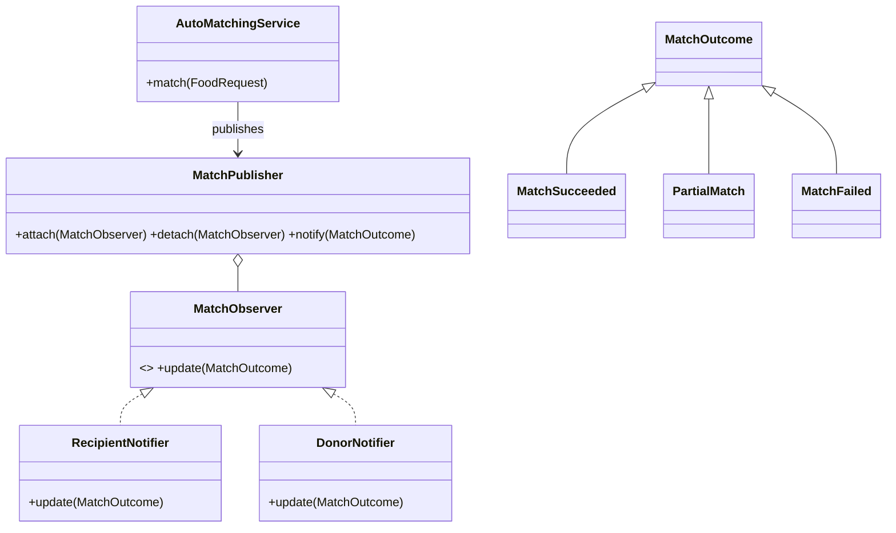

# Team Member 3 - Request & Auto Matching

Owner: Tan Tai Wei (2301297)

## What the module does

Recipients submit a food category, quantity, and preferred pickup time. They may optionally select a specific donation, which is prioritised before other suitable stock. `AutoMatchingService` selects only available, unexpired donations in the requested category, then applies nearest-expiry and first-come-first-served ordering. It allocates stock until the request is complete or supply is exhausted. A request becomes `matched`, `partial`, or remains `pending`; only a pending request can be withdrawn.

## MVC and ORM structure

- Model: `FoodRequest`, `MatchRecord`, `MatchNotification`, and the Module 2 integration model `Donation` use Eloquent ORM and object relationships.
- View: `resources/views/recipient/dashboard.blade.php` provides the request form, live availability, notifications, and request history.
- Controllers: `RecipientController` handles the browser workflow; `Api/FoodRequestController` exposes the internal web service.
- Service: `AutoMatchingService` owns matching rules and uses transactions plus row locks to prevent two requests allocating the same quantity.

## Observer pattern



The pattern is appropriate because matching should not be coupled to notification recipients. `MatchPublisher` maintains the subscriber collection, while `DonorNotifier` and `RecipientNotifier` implement the shared observer contract. More observers (email, SMS, volunteer coordination, or audit logging) can be attached without changing the allocation algorithm. The concrete `MatchSucceeded`, `PartialMatch`, and `MatchFailed` events make each result explicit.

## Internal API and IFA envelope

- `POST /api/v1/requests`
- `GET /api/v1/requests/{id}/match`
- `DELETE /api/v1/requests/{id}`

Every request must carry `X-Module-ID`, `X-Request-ID`, ISO-8601 `X-Timestamp`, and `X-Signature`. The signature is HMAC-SHA256 over a canonical request, and requests outside the five-minute clock-skew window are rejected. Responses contain `requestID`, ISO-8601 `timestamp`, `status`, and `data` (or an error `message`). A client request ID and payload fingerprint make POST retries idempotent while rejecting request-ID reuse with a different body. All endpoints are limited to 10 requests per module/IP per minute.

`ModuleApiClient` consumes Module 1 and Module 2 services with the same tracking/signature headers, validates their IFA response envelopes, uses a three-second timeout, and retries once.

Example body (tracking is supplied by headers):

```json
{
  "recipient_id": 1,
  "category": "Cooked Meals",
  "quantity": 12,
  "preferred_pickup_at": "2026-08-29T10:00:00+08:00"
}
```

## Secure coding analysis

1. Race condition / double allocation: two recipients could attempt to reserve the same quantity concurrently. The matcher wraps selection, allocation, notifications, and quantity updates in database transactions, uses `lockForUpdate()`, retries deadlocks up to three times, and enforces a unique request/donation constraint.
2. Forged or replayed inter-module calls: an attacker could repeat a valid POST or fabricate a request to consume stock. `VerifyModuleRequest` requires a fresh timestamp and an HMAC-SHA256 signature, while the unique request ID plus payload fingerprint makes exact retries safe and rejects conflicting replays.

Mandatory input validation remains implemented but is not counted as either security strategy. Additional controls include API throttling, UUID request/match identifiers, foreign-key integrity, authenticated Recipient ownership for browser actions, hidden passwords and replay fingerprints, escaped Blade output, and conflict responses when a matched request is withdrawn.

## Running and verification

Use PHP 8.3 or newer:

```bash
php artisan migrate --seed
php artisan serve
vendor/bin/pint --test
php artisan test
```

For a standalone demo, SQLite can be selected in `.env`. For the XAMPP setup, start MySQL and create the configured `foodbridge` database before migrating.
